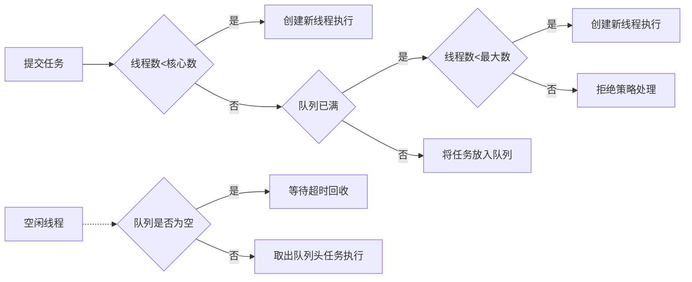
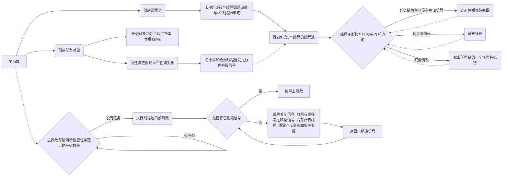
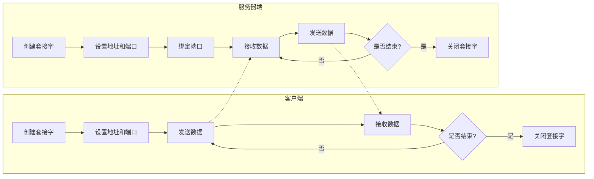

# linux cpp 网络编程学习

参考书为：linux c/c++服务器开发实践 朱文伟

## Ch1：TCP/IP基础

TCP/IP协议是为了解决不同系统的计算机之间的通信传输而提出的标准

### 一、TCP/IP协议的分层结构

由上至下：

- 应用层

  包括TELNET, FTP, SMTP, DNS, NNTP, HTTP协议

- 传输层（段segment，tcp/udp头，icmp，igmp头）

  包括TCP, UDP协议 （icmp，igmp也需要ip头，但从功能上属于网络层）

- 网络层（数据报datagram，ip头，arp头，rarp头）

  包括IP协议  (ARP, RARP也需要以太网（mac）头，但从功能属于数据链路层)

- 数据链路层（帧frame，mac头）

***

数据封装 -》 数据解封

IP地址：表示网络中不同的主机

端口号：标识同一台主机上不同的进程

### 二、应用层

## Ch2：搭建Linux开发环境

NAT模式：

NAT模式下虚拟机的IP地址是由VMware分配的，与宿主机的IP地址不同。这种模式允许虚拟机与宿主机之间、虚拟机与外部主机之间进行通信。虚拟机的IP只需要配置在NAT网段中，访问外部主机可以通过宿主机IP访问。从外部网络来看，虚拟机和主机共享一个IP

## Ch3：多线程基本编程

进程是对运行时程序的封装，是**系统进行资源调度和分配的的基本单位**，线程是进程的子任务，是**CPU调度和分派的基本单位**

### 一、利用POSIX多线程API进行多线程开发

利用POSIX多线程API进行多线程开发，需要使用一套定义了创建和操纵线程的函数，这些函数通常被称为Pthreads。Pthreads可以在Unix-like POSIX系统上运行，如Linux和Solaris

- Pthreads API中的函数可以非正式的划分为三大类： 
  1. **线程管理（Thread management）**: 第一类函数直接用于线程：创建（creating），分离（detaching），连接（joining）等等。包含了用于设置和查询线程属性（可连接，调度属性等）的函数。 
  2. **互斥量（Mutexes）**: 第二类函数是用于线程同步的，称为互斥量（mutexes），是"mutual exclusion"的缩写。Mutex函数提供了创建，销毁，锁定和解锁互斥量的功能。同时还包括了一些用于设定或修改互斥量属性的函数。 
  3. **条件变量（Condition variables）**：第三类函数处理共享一个互斥量的线程间的通信，基于程序员指定的条件。这类函数包括指定的条件变量的创建，销毁，等待和受信（signal）。设置查询条件变量属性的函数也包含其中。 

### 二、C++11中的线程类

### 三、线程同步

现代计算机操作系统的四大基本特性：并发，共享，虚拟，异步。

- 并发：**并发**是指宏观上在一段时间内能同时运行多个程序，而**并行**则指同一时刻能运行多个指令。单核处理器可以通过交替运行实现并发，多核处理器可以直接实现并行，但是操作系统也提供并发
- 共享：系统中的资源可供内存中多个并发执行的进程(线程)共同使用，包括互斥共享和同时共享
- 虚拟：把一个物理实体转换为多个逻辑实体
- 异步：进程不是一次性执行完毕，而是走走停停，以不可知的速度向前推进

***

- 线程同步：并发和异步机制带来了线程间资源竞争的无序性，需要同步来实现线程间正确有序的共享数据，以一致的顺序执行一组操作
- 临界资源：指一次仅允许一个线程使用的共享资源
- 临界区：每个线程中访问临界资源的代码段
- 原子操作：不会被线程调度机制打断的操作；这种操作一旦开始，就一直运行到结束，中间不会有任何上下文切换（切换到另一个线程）。原子操作可以保证数据的一致性和安全性，避免竞争和死锁的问题。原子操作通常依赖于硬件平台提供的特殊指令来实现

### 四、基于POSIX的线程同步

互斥锁：可以通过互斥锁来同步线程访问临界资源

读写锁：提供了比互斥锁更好的并行性（并行性好不代表速度更快），以读模式加锁后，当多个线程试图以读模式加锁时，不会造成 这些线程阻塞在等待锁的释放。写模式则是独占的

条件变量：让一个线程因等待“条件变量的条件”而挂起，另外一个线程在条件成立后，立即向挂起的线程发送条件成立的信号

***

- 生产者消费者问题（producer-consumer）

  也叫做有界缓冲区问题（bounded buffer），没有条件变量可能出现死锁的问题。

***

**Pthread_cond_wait函数**：

`pthread_cond_wait`函数是一个用于在条件变量上阻塞当前线程的函数，它需要和互斥锁配合使用。它的作用是让当前线程A（阻塞并释放mutex）等待其他线程B通过`pthread_cond_signal`（唤醒一个）或`pthread_cond_broadcast`（唤醒全部）来唤醒它，从而实现线程间的同步。具体来说，他实现以下功能（其中第一步加第二步是原子操作）：

- 释放已掌握的互斥锁（解锁互斥量）相当于ptherad_mutex_unlock (&mutex);
- 阻塞等待条件变量cond
- 当被唤醒，pthread_cond_wait函数返回时，解除阻塞并重新申请获取互斥锁pthread_mutex_lock (&mutex);（也是一个原子操作）

```c++
int pthread_cond_wait(pthread_cond_t *cond, pthread_mutex_t *mutex);
```

其中，cond是一个指向条件变量的指针，mutex是一个指向互斥锁的指针。这个函数返回0表示成功，非0表示失败

### 五、C++11/14中的线程同步

- 基本互斥锁
- 定时互斥锁
- 递归互斥锁
- 定时递归互斥锁

### 六、线程池

线程池就是一种管理线程的工具，它维护了一定数量的线程，可以重复利用已创建的线程来执行任务，避免了频繁地创建和销毁线程。这样可以降低资源消耗，提高响应速度，增加线程的可管理性。

一般来说，线程池有以下几个参数：

- 核心线程数：线程池中保持活跃的最小线程数，即使没有任务也不会被回收。
- 最大线程数：线程池中能够容纳的最大线程数，超过这个数量的任务会被拒绝。
- 任务队列：用于存放等待执行的任务的队列，可以有不同的实现方式，如数组、链表、同步队列等。
- 线程工厂：用于创建新线程的工厂类，可以自定义一些属性，如名称、优先级、守护状态等。
- 拒绝策略：当任务队列满了且达到最大线程数时，如何处理新来的任务，可以有不同的策略，如抛出异常、丢弃任务、阻塞调用者等。

---

流程如下：

- 当有新的任务提交时，首先判断当前线程池中的线程数是否小于核心数（corePoolSize），如果是，则创建一个新的线程来执行该任务，即使此时有空闲的线程。**（核心线程数是线程池中保持活跃的最小线程数，即使没有任务也不会被回收，所以如果当前活跃线程数小于核心线程数，说明还有核心线程没有创建出来，所以需要创建一个新的核心线程来执行任务。如果当前活跃线程数等于或大于核心线程数，则说明所有的核心线程都已经创建出来了，此时就可以用一个空闲的核心线程或非核心线程来执行任务。）**
- 如果当前线程数已经达到核心数，那么就判断任务队列（workQueue）是否已经满了，如果没有，则将该任务放入队列中，等待被空闲的线程取出执行。
- 如果任务队列已经满了，那么就判断当前线程数是否小于最大数（maximumPoolSize），如果是，则创建一个新的线程来执行该任务。**（线程池的设计是为了提高任务的执行效率和资源的利用率。如果任务队列已满，说明当前的任务量很大，而且可能还有新的任务提交。如果此时只使用空闲线程来执行任务，可能会导致任务等待时间过长，影响性能和用户体验。因此，线程池会创建新的线程来执行任务，直到达到最大线程数。）**
- 如果当前线程数已经达到最大数，那么就执行拒绝策略（RejectedExecutionHandler）来处理该任务，比如抛出异常、丢弃任务、阻塞调用者等。
- 当一个线程执行完一个任务后，它会变成空闲状态，并尝试从队列中取出头部的任务来执行。如果队列为空，则该线程会等待一段时间（keepAliveTime），如果超时还没有新的任务，则该线程会被回收。



3.8节线程池的例3.40，利用POSIX实现一个简单的线程池，这是该例的流程图：



## Ch4：TCP服务器编程

套接字编程包括tcp套接字编程，udp套接字编程，原始套接字编程

### 一、套接字基本概念

套接字是TCP/IP模型中应用层与传输层的中间抽象层，socket编程接口是应用层与传输层之间的编程接口

socket是一种“打开——读/写——关闭”模式的实现，服务器和客户端各自维护一个“文件”，在建立连接后，可以向自己文件写入内容供对方读取或者读取对方的内容，通信结束时关闭文件

### 二、网络程序的架构

- browser/server

- client/server (网络编程中使用的架构)

### 三、IP地址的格式转换

注意大小端问题

- IP地址的高低位：

  IP地址是一个32位的二进制数，通常分为四个字节，每个字节用一个十进制数表示，中间用点隔开。例如，127.0.0.1就是一个IP地址。IP地址可以分为网络部分和主机部分，不同的类别的IP地址有不同的划分方式。一般来说，网络部分在IP地址的高位字节中，主机部分在低位字节中。例如，对于A类地址，第一个字节是网络部分，后面三个字节是主机部分；对于B类地址，前两个字节是网络部分，后两个字节是主机部分。

- 高序字节：

  高序字节是指一个多字节数据中的最高有效位。例如，对于一个四字节的32位整数0x12345678，其高序字节是0x12，低序字节是0x78。

- 大小端：

  大小端是指数据在存储或者传输时的**字节顺序**，具体分为大端和小端。**大端是指将高序字节存储在起始地址**，**小端是指将低序字节存储在起始地址**。例如，对于一个由两个字节组成的16位整数0x1234，在内存中的存储方式如下：

  | 地址   | 大端 | 小端 |
  | :----- | :--- | :--- |
  | 0x1000 | 0x12 | 0x34 |
  | 0x1001 | 0x34 | 0x12 |

- 网络字节序：

  网络字节序是TCP/IP协议规定的一种数据表示格式，它与具体的CPU类型、操作系统等无关，从而可以保证数据在不同主机之间传输时能够被正确解释。网络字节序采用**大端模式**，即数据的高位字节存放在内存的低地址处。

  `UDP/TCP/IP协议规定:把接收到的第一个字节当作高位字节看待`,这就要求发送端发送的第一个字节是高位字节;而在发送端发送数据时,发送的第一个字节是该数值在内存中的起始地址处对应的那个字节,也就是说,该数值在内存中的起始地址处对应的那个字节就是要发送的第一个高位字节

- 主机字节序：

  主机字节序是指某个给定系统所用的字节顺序，它与CPU设计有关，不同的CPU可能有不同的主机字节序。比如x86系列CPU都是小端模式，而Motorola 6800为大端模式。当不同主机字节序的计算机之间进行网络通信时，需要将发送方的主机字节序转换为网络字节序，然后将接收方的网络字节序转换为主机字节序。

- 点分十进制的IP地址是一种人类可读的表示方式，它并不涉及存储方式的问题。所以直接看是看不出来的

  判断本地是大端还是小端的一种方法是通过强制类型转换截断一个多字节数据，看看低地址处存放的是高位字节还是低位字节

  举例说明：

  ```c
  #include <stdio.h>
  
  int isBigEndian()
  {
      unsigned short test = 0x1234; // 00010010 00110100
      if (*((unsigned char *)&test) == 0x12) // 取低地址处的字节
          return 1; // 大端模式
      else
          return 0; // 小端模式
  }
  
  int main()
  {
      if (isBigEndian())
          printf("This machine is big endian.\n");
      else
          printf("This machine is little endian.\n");
      return 0;
  }
  ```

***

inet_addr,inet_ntoa,inet_aton这些函数都是用来在IP地址和整数之间进行转换的，但是有一些区别:

- inet_addr()**把一个点分十进制的IP地址转换成一个网络字节序**（大端的无符号整数），如果输入无效，返回INADDR_NONE（通常是-1）。

- inet_ntoa()**把一个网络字节序转换成一个点分隔的IP地址**

- inet_aton()**把一个点分隔的IP地址转换成一个网络字节序的二进制数据，并存储在inp指向的结构体中，**如果地址有效，返回非零值，否则返回零。

  ---

- 不能在printf中用两个inet_ntoa

   这是因为inet_ntoa函数返回一个指向静态缓冲区的指针。在这种情况下，该函数被作为另一个函数的参数调用两次。函数参数的求值顺序是未指定的，因此静态缓冲区的内容将是最后运行的那个。所以你需要将打印分成两个单独的调用

### 四、套接字的类型

原始套接字和标准套接字的区别在于原始套接字可以读写内核没有处理的IP数据报，而标准套接字只能读TCP或者UDP报文

- 流套接字（SOCK_STREAM）

  提供面向连接，可靠的数据传输（因为用了TCP协议）

- 数据报套接字（SOCK_DGRAM）

  提供无连接服务（因为用了UDP协议）

- 原始套接字（SOCK_RAW）

  原始套接字允许对较低层次的协议直接访问（IP,ICMP），常用于检验新的协议实现，或者访问现有服务中配置的新设备，或者用于网络监听

### 五、套接字地址

一个套接字代表通信的一端，每端有一个套接字地址（套接字的一个参数）

socket地址包括：IP地址（从网络中识别主机），端口信息（从主机中识别进程）

socket地址分为：通用socket地址，专用socket地址（自定义专属网络地址）

本地机器上的套接字里保存的套接字地址是对方的还是自己的，取决于套接字的类型和使用场景：

- 对于流套接字（SOCK_STREAM），通常需要建立连接，所以本地机器上的套接字里保存了对方的套接字地址（IP地址和端口号）
- 对于数据报套接字（SOCK_DGRAM），通常不需要建立连接，所以本地机器上的套接字里保存了自己的套接字地址（IP地址和端口号）

***

获取套接字地址：

- getsockname()：获取本地

- getpeername()：获取对端

本地产生套接字地址：

- 本地套接字通过bind函数获取地址
- 本地套接字没有绑定地址，但是通过connect函数和远程建立了连接，此时内核会分配一个地址给本地套接字

### 六、主机字节序和网络字节序

- htonl()将uint32_t主机字节序转换为网络字节序
- ntohl()将uint32_t网络字节序转换为主机字节序
- htons()将uint16_t主机字节序转换为网络字节序
- ntohs()将uint16_t网络字节序转换为主机字节序

### 七、协议族和地址族

Linux支持PF和AF，所以指定协议用PF（protocol family），指定地址用AF（address family）

### 八、TCP套接字编程的基本步骤

服务器端编程的七个步骤一般是：

- 创建一个套接字（socket函数），用于监听客户端的连接请求。
- 绑定一个本地地址和端口到套接字上（bind函数），用于标识服务器的身份。
- 将套接字设置为监听模式（listen函数），用于等待客户端的连接请求，该套接字变成**监听套接字**。
- 接受一个客户端的连接请求，返回一个新的套接字（accept函数），用于和客户端进行通信。
- 通过新的套接字，与客户端进行数据交换（send和recv）。关闭与客户端的通信套接字，结束本次会话（closesocket函数）。
- 监听套接字继续监听，等待其他客户端连接请求。
- 关闭监听套接字（closesocket函数），结束服务器程序。

客户端编程的四个步骤一般是：

- 创建一个套接字（socket函数），用于和服务器进行通信。
- 向服务器发出连接请求（connect函数）。
- 和服务器通信（send和recv）
- 关闭客户端，关闭套接字（closesocket）。

### 九、TCP套接字编程的相关函数

- 客户端程序一般不调用bind函数来绑定socket地址，而使用socket默认的地址，是因为客户端不需要确定自己的ip和端口，而是由内核根据路由表来选择一个合适的本地地址和临时端口。如果你尝试读取了新创建的socket，里面的ip是0.0.0.0，端口也是0，那么表示这个socket还没有被绑定到任何具体的地址和端口上。当你调用connect或listen函数时，内核会为这个socket分配一个本地地址和临时端口。你可以通过getsockname函数来获取这个分配后的地址和端口。
- 服务器程序为什么要调用bind函数，是因为服务器需要在一个固定的地址和端口上监听客户端的连接请求。如果服务器不调用bind函数，那么内核会为套接字随机分配一个地址和端口，这样客户端就不知道怎么连接到服务器了。而客户端不需要调用bind函数，是因为客户端是主动向服务器发起连接请求的，内核会为客户端套接字自动分配一个本地地址和临时端口。客户端只需要知道服务器的地址和端口，就可以使用connect函数来建立连接了。

### 十、简单的TCP套接字编程

### 十一、深入理解TCP编程

- 数据收发涉及的缓冲区：

  发送端：应用程序发送缓冲区（程序员开辟），TCP套接字发送缓冲区（内核缓冲区）。调用send函数后，将数据从程序缓冲区拷贝到内核缓冲区，内核缓冲区发送至网络

  接收端：TCP套接字接收缓冲区（内核缓冲区），应用程序接收缓冲区，同样包含两个接收步骤


- 一次请求响应的数据接收

  接收端接收完全部数据后，接收就算结束，发送端断开连接。recv函数的返回值代表接收的字节数，发送端调用shutdown关闭发送，接收端看到recv的返回值为0，就跳出接收循环。

- 多次请求响应的数据接收（定长数据的接收）

  判断连接是否结束的方式是通信双方约定好发送数据的长度，接收方提前知道发送的数据长度，接收完固定长度后结束，发送方发送完并不调用shutdown

- 变长数据的接收

  方法1：数据报结尾增加结束标识符，如果碰到结束标识符，表示结束，需要扫描每个字符

  方法2：在数据报前加一个报头，报头里有一个字段表示消息长度
  
  扩展结构体：
  
  ```c++
  struct MyData {
      int nLen;
      char data[0];
  };
  ```
  
  - 可以实现数组的动态扩展，即根据需要分配不同大小的内存空间给结构体。
  - 可以节省内存空间，因为char data[0]不占用结构体的空间，只是一个指向结构体后面数据的地址。
  - 可以方便地通过data访问结构体后面的数据，而不需要额外的指针变量。
  
  一个简单的例子是：
  
  ```c
  #include <stdio.h>
  #include <stdlib.h>
  #include <string.h>
  
  struct MyData {
      int nLen;
      char data[0];
  };
  
  int main() {
      char str[10] = "123456789";
      struct MyData *p = (struct MyData *)malloc(sizeof(struct MyData) + strlen(str));
      memcpy(p->data, str, strlen(str));
      printf("p->data is %s\n", p->data);
      free(p);
      return 0;
  }
  ```
  
  输出：
  
  ```text
  p->data is 123456789
  ```
  
  可以看到，通过malloc分配了一个大小为sizeof(struct MyData) + strlen(str)的内存空间给p，然后将str拷贝到p->data中，最后通过p->data打印出了str的内容。
  

### 十二、I/O控制命令

套接字的IO控制用于设置套接字的工作模式（阻塞式或者非阻塞式），也可以用来获取与套接字相关的IO操作的参数信息（比如读取输入缓冲区的字节数）

### 十三、套接字选项

设置或者获取套接字的属性

## Ch5：UDP服务器编程

UDP是无连接的不可靠的数据报协议，优点在于开销小（不用建立连接和撤销连接），速度快，缺点在于数据可能丢失

### 一、UDP套接字编程的基本步骤



服务器：

- 创建socket
- bind地址
- 从套接字recvfrom客户端请求，得到客户端地址
- sendto信息给客户端
- 循环或者关闭

客户端：

- 创建socket
- sendto信息给服务器
- 从套接字recvfrom服务器应答
- 循环或者关闭

### 二、UDP套接字编程的相关函数

- sendto
- recvfrom

### 三、实战UDP套接字

### 四、UDP丢包以及无须问题

丢包：服务器的socket接收缓存满了，系统丢弃后来的包；或服务器处理收到的包的时间内没有接收新的包

- 在服务器单独开一个线程接收UDP包，放在单独缓冲区，用其他线程处理数据
- 减慢客户端发送速度，比如增加sleep时间

更好的解决办法：

- 模拟TCP
- 重发请求（ARQ）协议：连续ARQ，选择重发ARQ，滑动窗口
- 自己实现确认重传

## Ch6：原始套接字编程

Raw socket：在传输层下面使用的套接字，可以在链路层收发原始数据帧，在用户空间完成MAC上各个层次的实现

### 一、原始套接字的功能

- 收发ICMPv4、ICMPv6、IGMP数据报
- 设置IP报头
- 收发内核不处理的IPv4数据报
- 让网卡处于混杂模式，从而捕获流经网卡的所有数据报（制作网络嗅探器）

### 二、创建原始套接字的方式

创建原始套接字的方式有以下几种：

- 使用socket()函数，第一个参数设置为PF_PACKET，第二个参数设置为SOCK_RAW，第三个参数设置为htons(protocol)，其中protocol是指定可以接收或发送的数据包类型，如ETH_P_IP、ETH_P_ARP、ETH_P_ALL等。**这种方式可以创建链路层的原始套接字，可以接收或发送本机网卡上所有的数据帧。**
- 使用socket()函数，第一个参数设置为AF_INET，第二个参数设置为SOCK_RAW，第三个参数设置为protocol，其中protocol是指定IP协议类型，如IPPROTO_TCP、IPPROTO_UDP、IPPROTO_ICMP等。**这种方式可以创建IP层的原始套接字，可以接收或发送本机收发的IP包。**
- 使用socket()函数，第一个参数设置为AF_INET6，第二个参数设置为SOCK_RAW，第三个参数设置为protocol，其中protocol是指定IPv6协议类型，如IPPROTO_TCP、IPPROTO_UDP、IPPROTO_ICMPV6等。**这种方式可以创建IPv6层的原始套接字，可以接收或发送本机收发的IPv6包。**

原始套接字的使用需要注意以下几点：

- 原始套接字需要root权限或CAP_NET_RAW能力才能创建。
- 原始套接字发送数据时需要自己构造协议头部，如以太网头、IP头、TCP头等。
- 原始套接字接收数据时需要自己解析协议头部，如以太网头、IP头、TCP头等。
- 原始套接字可以用于实现高级网络编程，如抓包、分析、欺骗等。

### 三、原始套接字的基本编程步骤

```
+----------+-----------+----------+----------+
| 链路层报头 | 网络层报头 | 传输层报头 | 应用层数据 |
+----------+-----------+----------+----------+
```

其中，应用层数据是用户数据部分，传输层报头包括TCP报头或UDP报头，网络层报头包括IP报头，链路层报头包括以太网帧头。

- 如果您使用流套接字`（SOCK_STREAM）`或数据报套接字`（SOCK_DGRAM）`，您只能看到用户数据部分，而无法查看任何报头。

- 如果您使用原始套接字 `sockfd = socket(AF_INET, SOCK_RAW, IPPROTO_UDP)`，则表示您可以查看接收到的数据的IP报头内容和UDP报头内容。

- 如果您使用原始套接字 `sockfd = socket(PF_PACKET, SOCK_RAW, htons(ETH_P_ALL))`，则您可以查看接收到的数据的链路层报头内容，包括以太网帧头、网络层报头（如IP报头）和传输层报头（如TCP报头）。

### 四、AF_INET方式捕获报文

在接收端程序中，`saddr.sin_port = htons(8888); `这一行代码指定了监听套接字绑定的端口号。这里的端口号是指定监听套接字监听哪个端口号。如果使用了原始套接字（SOCK_RAW），这意味着你可以接收到所有目标地址为本机地址的UDP数据包，而不管目标端口号是什么。因此，在这种情况下，绑定的端口号并不重要。

当你使用非原始套接字（例如`SOCK_DGRAM`）时，监听套接字的端口号必须和发送数据时使用的目标端口号一样。这样，监听套接字才能接收到发送到指定端口号的数据包。

例如，如果你在发送端使用`sendto`函数发送数据，并指定目标端口号为8888，那么在接收端，你需要创建一个非原始套接字，并将其绑定到端口号8888，才能接收到发送的数据包。

### 五、PF_PACKET方式捕获报文

## Ch7：服务器模型设计

