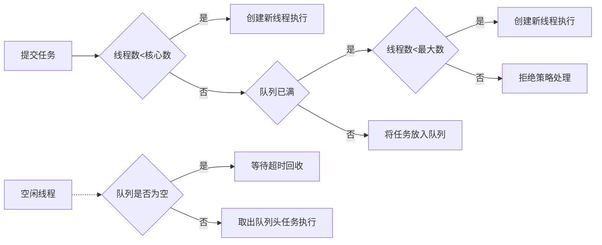
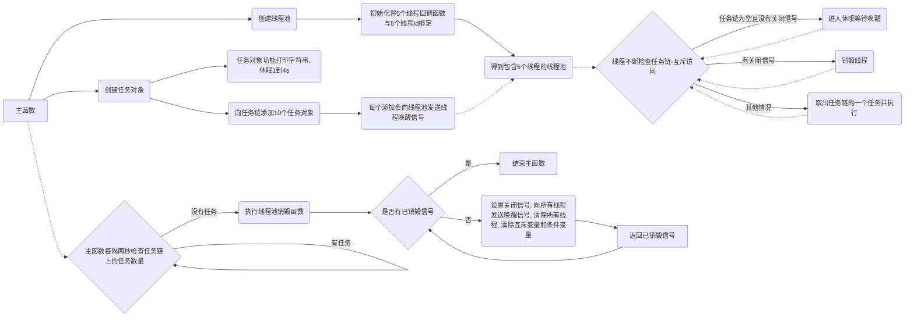
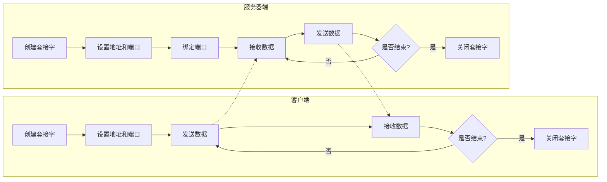
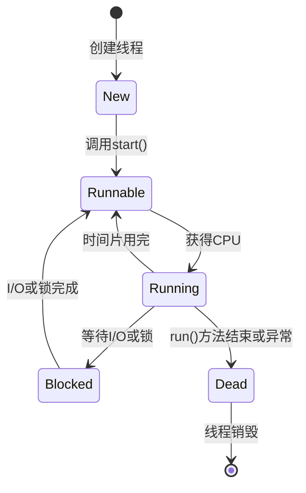
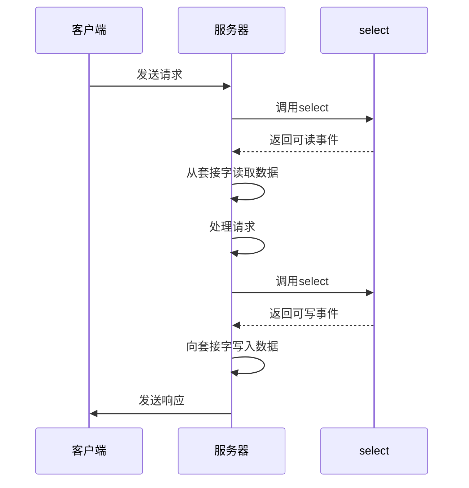

# linux cpp 网络编程学习

参考书为：linux c/c++服务器开发实践 朱文伟

## Ch1：TCP/IP基础

TCP/IP协议是为了解决不同系统的计算机之间的通信传输而提出的标准

### 一、TCP/IP协议的分层结构

由上至下：

- 应用层

  包括TELNET, FTP, SMTP, DNS, NNTP, HTTP协议

- 传输层（段segment，tcp/udp头，icmp，igmp头）

  包括TCP, UDP协议 （icmp，igmp也需要ip头，但从功能上属于网络层）

- 网络层（数据报datagram，ip头，arp头，rarp头）

  包括IP协议  (ARP, RARP也需要以太网（mac）头，但从功能属于数据链路层)

- 数据链路层（帧frame，mac头）

***

数据封装 -》 数据解封

### 二、应用层

**2.1DNS**

域名：主机的别名，为了实现用域名访问主机，需要转换成IP地址

DNS是一个将域名和IP地址相互映射的分布式数据库

> 当您在浏览器中输入一个域名并按下回车键时，您的计算机会将该域名发送到您的DNS服务器。然后，DNS服务器会查询其数据库，找到与该域名对应的IP地址，并将其返回给您的计算机。接下来，您的计算机会使用该IP地址与目标网站建立连接。

**2.2端口**

端口号：标识同一台主机上不同的进程，16位无符号int（0-65535, $2^{16}-1$），前1024个为系统使用，web（80），ftp（21），smtp（23）

### 三、传输层

**3.1TCP协议**

面向连接，高可靠性的传输层协议。TCP header一共20字节

**3.2UDP协议**

无连接，不可靠的传输层协议。UDP header一共8字节

### 四、网络层

**4.1IP协议**

IP地址：表示网络中不同的主机

- 不可靠：不能保证IP数据报成功到达目的地
- 无连接：不维护任何关于后续数据报的状态信息
- 无状态：通信双方不同步传输数据的状态信息

ipv4报头的最小长度为20字节

## Ch2：搭建Linux开发环境

### 一、NAT模式（network address translation）：

NAT模式下虚拟机的IP地址是由VMware分配的，与宿主机的IP地址不同。这种模式允许虚拟机与宿主机之间、虚拟机与外部主机之间进行通信。虚拟机的IP只需要配置在NAT网段中，访问外部主机可以通过宿主机IP访问。从外部网络来看，虚拟机和主机共享一个IP

### 二、桥接模式：

### 三、主机模式：

## Ch3：多线程基本编程

进程是对运行时程序的封装，是**系统进行资源调度和分配的的基本单位**，线程是进程的子任务，是**CPU调度和分派的基本单位**

### 一、利用POSIX多线程API进行多线程开发

利用POSIX多线程API进行多线程开发，需要使用一套定义了创建和操纵线程的函数，这些函数通常被称为Pthreads。Pthreads可以在Unix-like POSIX系统上运行，如Linux和Solaris

- Pthreads API中的函数可以非正式的划分为三大类： 
  1. **线程管理（Thread management）**: 第一类函数直接用于线程：创建（creating），分离（detaching），连接（joining）等等。包含了用于设置和查询线程属性（可连接，调度属性等）的函数。 
  2. **互斥量（Mutexes）**: 第二类函数是用于线程同步的，称为互斥量（mutexes），是"mutual exclusion"的缩写。Mutex函数提供了创建，销毁，锁定和解锁互斥量的功能。同时还包括了一些用于设定或修改互斥量属性的函数。 
  3. **条件变量（Condition variables）**：第三类函数处理共享一个互斥量的线程间的通信，基于程序员指定的条件。这类函数包括指定的条件变量的创建，销毁，等待和受信（signal）。设置查询条件变量属性的函数也包含其中。 

### 二、C++11中的线程类

### 三、线程同步

现代计算机操作系统的四大基本特性：并发，共享，虚拟，异步。

- 并发：**并发**是指宏观上在一段时间内能同时运行多个程序，而**并行**则指同一时刻能运行多个指令。单核处理器可以通过交替运行实现并发，多核处理器可以直接实现并行，但是操作系统也提供并发
- 共享：系统中的资源可供内存中多个并发执行的进程(线程)共同使用，包括互斥共享和同时共享
- 虚拟：把一个物理实体转换为多个逻辑实体
- 异步：进程不是一次性执行完毕，而是走走停停，以不可知的速度向前推进

***

- 线程同步：并发和异步机制带来了线程间资源竞争的无序性，需要同步来实现线程间正确有序的共享数据，以一致的顺序执行一组操作
- 临界资源：指一次仅允许一个线程使用的共享资源
- 临界区：每个线程中访问临界资源的代码段
- 原子操作：不会被线程调度机制打断的操作；这种操作一旦开始，就一直运行到结束，中间不会有任何上下文切换（切换到另一个线程）。原子操作可以保证数据的一致性和安全性，避免竞争和死锁的问题。原子操作通常依赖于硬件平台提供的特殊指令来实现

### 四、基于POSIX的线程同步

互斥锁：可以通过互斥锁来同步线程访问临界资源

读写锁：提供了比互斥锁更好的并行性（并行性好不代表速度更快），以读模式加锁后，当多个线程试图以读模式加锁时，不会造成 这些线程阻塞在等待锁的释放。写模式则是独占的

条件变量：让一个线程因等待“条件变量的条件”而挂起，另外一个线程在条件成立后，立即向挂起的线程发送条件成立的信号

***

- 生产者消费者问题（producer-consumer）

  也叫做有界缓冲区问题（bounded buffer），没有条件变量可能出现死锁的问题。

***

**Pthread_cond_wait函数**：

`pthread_cond_wait`函数是一个用于在条件变量上阻塞当前线程的函数，它需要和互斥锁配合使用。它的作用是让当前线程A（阻塞并释放mutex）等待其他线程B通过`pthread_cond_signal`（唤醒一个）或`pthread_cond_broadcast`（唤醒全部）来唤醒它，从而实现线程间的同步。具体来说，他实现以下功能（其中第一步加第二步是原子操作）：

- 释放已掌握的互斥锁（解锁互斥量）相当于ptherad_mutex_unlock (&mutex);
- 阻塞等待条件变量cond
- 当被唤醒，pthread_cond_wait函数返回时，解除阻塞并重新申请获取互斥锁pthread_mutex_lock (&mutex);（也是一个原子操作）

```c++
int pthread_cond_wait(pthread_cond_t *cond, pthread_mutex_t *mutex);
```

其中，cond是一个指向条件变量的指针，mutex是一个指向互斥锁的指针。这个函数返回0表示成功，非0表示失败

### 五、C++11/14中的线程同步

- 基本互斥锁
- 定时互斥锁
- 递归互斥锁
- 定时递归互斥锁

### 六、线程池

线程池就是一种管理线程的工具，它维护了一定数量的线程，可以重复利用已创建的线程来执行任务，避免了频繁地创建和销毁线程。这样可以降低资源消耗，提高响应速度，增加线程的可管理性。

一般来说，线程池有以下几个参数：

- 核心线程数：线程池中保持活跃的最小线程数，即使没有任务也不会被回收。
- 最大线程数：线程池中能够容纳的最大线程数，超过这个数量的任务会被拒绝。
- 任务队列：用于存放等待执行的任务的队列，可以有不同的实现方式，如数组、链表、同步队列等。
- 线程工厂：用于创建新线程的工厂类，可以自定义一些属性，如名称、优先级、守护状态等。
- 拒绝策略：当任务队列满了且达到最大线程数时，如何处理新来的任务，可以有不同的策略，如抛出异常、丢弃任务、阻塞调用者等。

---

流程如下：

- 当有新的任务提交时，首先判断当前线程池中的线程数是否小于核心数（corePoolSize），如果是，则创建一个新的线程来执行该任务，即使此时有空闲的线程。**（核心线程数是线程池中保持活跃的最小线程数，即使没有任务也不会被回收，所以如果当前活跃线程数小于核心线程数，说明还有核心线程没有创建出来，所以需要创建一个新的核心线程来执行任务。如果当前活跃线程数等于或大于核心线程数，则说明所有的核心线程都已经创建出来了，此时就可以用一个空闲的核心线程或非核心线程来执行任务。）**
- 如果当前线程数已经达到核心数，那么就判断任务队列（workQueue）是否已经满了，如果没有，则将该任务放入队列中，等待被空闲的线程取出执行。
- 如果任务队列已经满了，那么就判断当前线程数是否小于最大数（maximumPoolSize），如果是，则创建一个新的线程来执行该任务。**（线程池的设计是为了提高任务的执行效率和资源的利用率。如果任务队列已满，说明当前的任务量很大，而且可能还有新的任务提交。如果此时只使用空闲线程来执行任务，可能会导致任务等待时间过长，影响性能和用户体验。因此，线程池会创建新的线程来执行任务，直到达到最大线程数。）**
- 如果当前线程数已经达到最大数，那么就执行拒绝策略（RejectedExecutionHandler）来处理该任务，比如抛出异常、丢弃任务、阻塞调用者等。
- 当一个线程执行完一个任务后，它会变成空闲状态，并尝试从队列中取出头部的任务来执行。如果队列为空，则该线程会等待一段时间（keepAliveTime），如果超时还没有新的任务，则该线程会被回收。



3.8节线程池的例3.40，利用POSIX实现一个简单的线程池，这是该例的流程图：



## Ch4：TCP服务器编程

套接字编程包括tcp套接字编程，udp套接字编程，原始套接字编程

### 一、套接字基本概念

套接字是TCP/IP模型中应用层与传输层的中间抽象层，socket编程接口是应用层与传输层之间的编程接口

socket是一种“打开——读/写——关闭”模式的实现，服务器和客户端各自维护一个“文件”，在建立连接后，可以向自己文件写入内容供对方读取或者读取对方的内容，通信结束时关闭文件

### 二、网络程序的架构

- browser/server

- client/server (网络编程中使用的架构)

### 三、IP地址的格式转换

注意大小端问题

- IP地址的高低位：

  IP地址是一个32位的二进制数，通常分为四个字节，每个字节用一个十进制数表示，中间用点隔开。例如，127.0.0.1就是一个IP地址。IP地址可以分为网络部分和主机部分，不同的类别的IP地址有不同的划分方式。一般来说，网络部分在IP地址的高位字节中，主机部分在低位字节中。例如，对于A类地址，第一个字节是网络部分，后面三个字节是主机部分；对于B类地址，前两个字节是网络部分，后两个字节是主机部分。

- 高序字节：

  高序字节是指一个多字节数据中的最高有效位。例如，对于一个四字节的32位整数0x12345678，其高序字节是0x12，低序字节是0x78。

- 大小端：

  大小端是指数据在存储或者传输时的**字节顺序**，具体分为大端和小端。**大端是指将高序字节存储在起始地址**，**小端是指将低序字节存储在起始地址**。例如，对于一个由两个字节组成的16位整数0x1234，在内存中的存储方式如下：

  | 地址   | 大端 | 小端 |
  | :----- | :--- | :--- |
  | 0x1000 | 0x12 | 0x34 |
  | 0x1001 | 0x34 | 0x12 |

- 网络字节序：

  网络字节序是TCP/IP协议规定的一种数据表示格式，它与具体的CPU类型、操作系统等无关，从而可以保证数据在不同主机之间传输时能够被正确解释。网络字节序采用**大端模式**，即数据的高位字节存放在内存的低地址处。

  `UDP/TCP/IP协议规定:把接收到的第一个字节当作高位字节看待`,这就要求发送端发送的第一个字节是高位字节;而在发送端发送数据时,发送的第一个字节是该数值在内存中的起始地址处对应的那个字节,也就是说,该数值在内存中的起始地址处对应的那个字节就是要发送的第一个高位字节

- 主机字节序：

  主机字节序是指某个给定系统所用的字节顺序，它与CPU设计有关，不同的CPU可能有不同的主机字节序。比如x86系列CPU都是小端模式，而Motorola 6800为大端模式。当不同主机字节序的计算机之间进行网络通信时，需要将发送方的主机字节序转换为网络字节序，然后将接收方的网络字节序转换为主机字节序。

- 点分十进制的IP地址是一种人类可读的表示方式，它并不涉及存储方式的问题。所以直接看是看不出来的

  判断本地是大端还是小端的一种方法是通过强制类型转换截断一个多字节数据，看看低地址处存放的是高位字节还是低位字节

  举例说明：

  ```c
  #include <stdio.h>
  
  int isBigEndian()
  {
      unsigned short test = 0x1234; // 00010010 00110100
      if (*((unsigned char *)&test) == 0x12) // 取低地址处的字节
          return 1; // 大端模式
      else
          return 0; // 小端模式
  }
  
  int main()
  {
      if (isBigEndian())
          printf("This machine is big endian.\n");
      else
          printf("This machine is little endian.\n");
      return 0;
  }
  ```

***

inet_addr,inet_ntoa,inet_aton这些函数都是用来在IP地址和整数之间进行转换的，但是有一些区别:

- inet_addr()**把一个点分十进制的IP地址转换成一个网络字节序**（大端的无符号整数），如果输入无效，返回INADDR_NONE（通常是-1）。

- inet_ntoa()**把一个网络字节序转换成一个点分隔的IP地址**

- inet_aton()**把一个点分隔的IP地址转换成一个网络字节序的二进制数据，并存储在inp指向的结构体中，**如果地址有效，返回非零值，否则返回零。

  ---

- 不能在printf中用两个inet_ntoa

   这是因为inet_ntoa函数返回一个指向静态缓冲区的指针。在这种情况下，该函数被作为另一个函数的参数调用两次。函数参数的求值顺序是未指定的，因此静态缓冲区的内容将是最后运行的那个。所以你需要将打印分成两个单独的调用

### 四、套接字的类型

原始套接字和标准套接字的区别在于原始套接字可以读写内核没有处理的IP数据报，而标准套接字只能读TCP或者UDP报文

- 流套接字（SOCK_STREAM）

  提供面向连接，可靠的数据传输（因为用了TCP协议）

- 数据报套接字（SOCK_DGRAM）

  提供无连接服务（因为用了UDP协议）

- 原始套接字（SOCK_RAW）

  原始套接字允许对较低层次的协议直接访问（IP,ICMP），常用于检验新的协议实现，或者访问现有服务中配置的新设备，或者用于网络监听

### 五、套接字地址

一个套接字代表通信的一端，每端有一个套接字地址（套接字的一个参数）

socket地址包括：IP地址（从网络中识别主机），端口信息（从主机中识别进程）

socket地址分为：通用socket地址，专用socket地址（自定义专属网络地址）

本地机器上的套接字里保存的套接字地址是对方的还是自己的，取决于套接字的类型和使用场景：

- 对于流套接字（SOCK_STREAM），通常需要建立连接，所以本地机器上的套接字里保存了对方的套接字地址（IP地址和端口号）
- 对于数据报套接字（SOCK_DGRAM），通常不需要建立连接，所以本地机器上的套接字里保存了自己的套接字地址（IP地址和端口号）

***

获取套接字地址：

- getsockname()：获取本地

- getpeername()：获取对端

本地产生套接字地址：

- 本地套接字通过bind函数获取地址
- 本地套接字没有绑定地址，但是通过connect函数和远程建立了连接，此时内核会分配一个地址给本地套接字

### 六、主机字节序和网络字节序

- htonl()将uint32_t主机字节序转换为网络字节序
- ntohl()将uint32_t网络字节序转换为主机字节序
- htons()将uint16_t主机字节序转换为网络字节序
- ntohs()将uint16_t网络字节序转换为主机字节序

### 七、协议族和地址族

Linux支持PF和AF，所以指定协议用PF（protocol family），指定地址用AF（address family）

### 八、TCP套接字编程的基本步骤

服务器端编程的七个步骤一般是：

- 创建一个套接字（socket函数），用于监听客户端的连接请求。
- 绑定一个本地地址和端口到套接字上（bind函数），用于标识服务器的身份。
- 将套接字设置为监听模式（listen函数），用于等待客户端的连接请求，该套接字变成**监听套接字**。
- 接受一个客户端的连接请求，返回一个新的套接字（accept函数），用于和客户端进行通信。
- 通过新的套接字，与客户端进行数据交换（send和recv）。关闭与客户端的通信套接字，结束本次会话（closesocket函数）。
- 监听套接字继续监听，等待其他客户端连接请求。
- 关闭监听套接字（closesocket函数），结束服务器程序。

客户端编程的四个步骤一般是：

- 创建一个套接字（socket函数），用于和服务器进行通信。
- 向服务器发出连接请求（connect函数）。
- 和服务器通信（send和recv）
- 关闭客户端，关闭套接字（closesocket）。

### 九、TCP套接字编程的相关函数

- 客户端程序一般不调用bind函数来绑定socket地址，而使用socket默认的地址，是因为客户端不需要确定自己的ip和端口，而是由内核根据路由表来选择一个合适的本地地址和临时端口。如果你尝试读取了新创建的socket，里面的ip是0.0.0.0，端口也是0，那么表示这个socket还没有被绑定到任何具体的地址和端口上。当你调用connect或listen函数时，内核会为这个socket分配一个本地地址和临时端口。你可以通过getsockname函数来获取这个分配后的地址和端口。
- 服务器程序为什么要调用bind函数，是因为服务器需要在一个固定的地址和端口上监听客户端的连接请求。如果服务器不调用bind函数，那么内核会为套接字随机分配一个地址和端口，这样客户端就不知道怎么连接到服务器了。而客户端不需要调用bind函数，是因为客户端是主动向服务器发起连接请求的，内核会为客户端套接字自动分配一个本地地址和临时端口。客户端只需要知道服务器的地址和端口，就可以使用connect函数来建立连接了。

### 十、简单的TCP套接字编程

### 十一、深入理解TCP编程

- 数据收发涉及的缓冲区：

  发送端：应用程序发送缓冲区（程序员开辟），TCP套接字发送缓冲区（内核缓冲区）。调用send函数后，将数据从程序缓冲区拷贝到内核缓冲区，内核缓冲区发送至网络

  接收端：TCP套接字接收缓冲区（内核缓冲区），应用程序接收缓冲区，同样包含两个接收步骤


- 一次请求响应的数据接收

  接收端接收完全部数据后，接收就算结束，发送端断开连接。recv函数的返回值代表接收的字节数，发送端调用shutdown关闭发送，接收端看到recv的返回值为0，就跳出接收循环。

- 多次请求响应的数据接收（定长数据的接收）

  判断连接是否结束的方式是通信双方约定好发送数据的长度，接收方提前知道发送的数据长度，接收完固定长度后结束，发送方发送完并不调用shutdown

- 变长数据的接收

  方法1：数据报结尾增加结束标识符，如果碰到结束标识符，表示结束，需要扫描每个字符

  方法2：在数据报前加一个报头，报头里有一个字段表示消息长度
  
  扩展结构体：
  
  ```c++
  struct MyData {
      int nLen;
      char data[0];
  };
  ```
  
  - 可以实现数组的动态扩展，即根据需要分配不同大小的内存空间给结构体。
  - 可以节省内存空间，因为char data[0]不占用结构体的空间，只是一个指向结构体后面数据的地址。
  - 可以方便地通过data访问结构体后面的数据，而不需要额外的指针变量。
  
  一个简单的例子是：
  
  ```c
  #include <stdio.h>
  #include <stdlib.h>
  #include <string.h>
  
  struct MyData {
      int nLen;
      char data[0];
  };
  
  int main() {
      char str[10] = "123456789";
      struct MyData *p = (struct MyData *)malloc(sizeof(struct MyData) + strlen(str));
      memcpy(p->data, str, strlen(str));
      printf("p->data is %s\n", p->data);
      free(p);
      return 0;
  }
  ```
  
  输出：
  
  ```text
  p->data is 123456789
  ```
  
  可以看到，通过malloc分配了一个大小为sizeof(struct MyData) + strlen(str)的内存空间给p，然后将str拷贝到p->data中，最后通过p->data打印出了str的内容。
  

### 十二、I/O控制命令

套接字的IO控制用于设置套接字的工作模式（阻塞式或者非阻塞式），也可以用来获取与套接字相关的IO操作的参数信息（比如读取输入缓冲区的字节数）

### 十三、套接字选项

设置或者获取套接字的属性

## Ch5：UDP服务器编程

UDP是无连接的不可靠的数据报协议，优点在于开销小（不用建立连接和撤销连接），速度快，缺点在于数据可能丢失

### 一、UDP套接字编程的基本步骤



服务器：

- 创建socket
- bind地址
- 从套接字recvfrom客户端请求，得到客户端地址
- sendto信息给客户端
- 循环或者关闭

客户端：

- 创建socket
- sendto信息给服务器
- 从套接字recvfrom服务器应答
- 循环或者关闭

### 二、UDP套接字编程的相关函数

- sendto
- recvfrom

### 三、实战UDP套接字

### 四、UDP丢包以及无须问题

丢包：服务器的socket接收缓存满了，系统丢弃后来的包；或服务器处理收到的包的时间内没有接收新的包

- 在服务器单独开一个线程接收UDP包，放在单独缓冲区，用其他线程处理数据
- 减慢客户端发送速度，比如增加sleep时间

更好的解决办法：

- 模拟TCP
- 重发请求（ARQ）协议：连续ARQ，选择重发ARQ，滑动窗口
- 自己实现确认重传

## Ch6：原始套接字编程

Raw socket：在传输层下面使用的套接字，可以在链路层收发原始数据帧，在用户空间完成MAC上各个层次的实现

### 一、原始套接字的功能

- 收发ICMPv4、ICMPv6、IGMP数据报
- 设置IP报头
- 收发内核不处理的IPv4数据报
- 让网卡处于混杂模式，从而捕获流经网卡的所有数据报（制作网络嗅探器）

### 二、创建原始套接字的方式

创建原始套接字的方式有以下几种：

- 使用socket()函数，第一个参数设置为PF_PACKET，第二个参数设置为SOCK_RAW，第三个参数设置为htons(protocol)，其中protocol是指定可以接收或发送的数据包类型，如ETH_P_IP、ETH_P_ARP、ETH_P_ALL等。**这种方式可以创建链路层的原始套接字，可以接收或发送本机网卡上所有的数据帧。**
- 使用socket()函数，第一个参数设置为AF_INET，第二个参数设置为SOCK_RAW，第三个参数设置为protocol，其中protocol是指定IP协议类型，如IPPROTO_TCP、IPPROTO_UDP、IPPROTO_ICMP等。**这种方式可以创建IP层的原始套接字，可以接收或发送本机收发的IP包。**
- 使用socket()函数，第一个参数设置为AF_INET6，第二个参数设置为SOCK_RAW，第三个参数设置为protocol，其中protocol是指定IPv6协议类型，如IPPROTO_TCP、IPPROTO_UDP、IPPROTO_ICMPV6等。**这种方式可以创建IPv6层的原始套接字，可以接收或发送本机收发的IPv6包。**

原始套接字的使用需要注意以下几点：

- 原始套接字需要root权限或CAP_NET_RAW能力才能创建。
- 原始套接字发送数据时需要自己构造协议头部，如以太网头、IP头、TCP头等。
- 原始套接字接收数据时需要自己解析协议头部，如以太网头、IP头、TCP头等。
- 原始套接字可以用于实现高级网络编程，如抓包、分析、欺骗等。

### 三、原始套接字的基本编程步骤

```
+----------+-----------+----------+----------+
| 链路层报头 | 网络层报头 | 传输层报头 | 应用层数据 |
+----------+-----------+----------+----------+
```

其中，应用层数据是用户数据部分，传输层报头包括TCP报头或UDP报头，网络层报头包括IP报头，链路层报头包括以太网帧头。

- 如果您使用流套接字`（SOCK_STREAM）`或数据报套接字`（SOCK_DGRAM）`，您只能看到用户数据部分，而无法查看任何报头。

- 如果您使用原始套接字 `sockfd = socket(AF_INET, SOCK_RAW, IPPROTO_UDP)`，则表示您可以查看接收到的数据的IP报头内容和UDP报头内容。

- 如果您使用原始套接字 `sockfd = socket(PF_PACKET, SOCK_RAW, htons(ETH_P_ALL))`，则您可以查看接收到的数据的链路层报头内容，包括以太网帧头、网络层报头（如IP报头）和传输层报头（如TCP报头）。

### 四、AF_INET方式捕获报文

在接收端程序中，`saddr.sin_port = htons(8888); `这一行代码指定了监听套接字绑定的端口号。这里的端口号是指定监听套接字监听哪个端口号。如果使用了原始套接字（SOCK_RAW），这意味着你可以接收到所有目标地址为本机地址的UDP数据包，而不管目标端口号是什么。因此，在这种情况下，绑定的端口号并不重要。

当你使用非原始套接字（例如`SOCK_DGRAM`）时，监听套接字的端口号必须和发送数据时使用的目标端口号一样。这样，监听套接字才能接收到发送到指定端口号的数据包。

例如，如果你在发送端使用`sendto`函数发送数据，并指定目标端口号为8888，那么在接收端，你需要创建一个非原始套接字，并将其绑定到端口号8888，才能接收到发送的数据包。

### 五、PF_PACKET方式捕获报文

## Ch7：服务器模型设计

按照协议来分有TCP服务器和UDP服务器，按照处理方式分为循环服务器和并发服务器

- 循环服务器

  服务器需要处理多个客户端，循环的同一时刻只能响应一个客户端请求。优点是简单，缺点是会造成其他客户端等待时间过长

- 并发服务器

  利用多线程或者多进程，同一时刻可以响应多个客户端请求（为每个客户端创建一个任务）

服务器的设计模型有：

- (分时)循环服务器
- 多进程/多线程并发服务器
- I/O复用并发服务器

小规模用循环服务器，大规模用并发服务器

### 一、I/O模型

**1.1基本概念**

（服务器模型和IO模型是两个概念）

- IO：数据的读取写入/接收发送
- 用户进程的完整IO：（1）用户空间《---》内核空间  （2）内核空间《---》设备空间（磁盘，网卡）
- IO分类：内存IO，网络IO（本书），磁盘IO

---

**网络IO的本质是对socket的读取**，socket在Linux中被抽象为**流**，IO可以理解为**对流的操作**，对于一次IO访问，数据会先被拷贝到OS的内核缓冲区，再从操作系统的内核缓冲区拷贝到应用程序的地址空间

网络应用需要处理的两大类问题：**网络IO和数据计算**，网络IO的瓶颈更大，所以更重要。

网络IO模型分类：

- 异步IO（asynchronous IO）
- 同步IO（synchronous IO）:阻塞IO（blocking IO），非阻塞IO（non-blocking IO），多路复用IO（multiplexing IO），信号驱动IO（signal-driven IO）

---

**1.2同步和异步（消息的通知机制）**

对于一个线程的请求调用，如果需要等待最终结果，则为同步；如果在没有得到结果的情况下返回，则为异步。例如调用`readfrom`系统调用，必须等到IO操作完成返回，就是同步。调用`aio_read`，不用等IO操作完成直接返回，调用结果通过信号通知调用者。

对于多个线程来说，同步指线程间的步调一致，需要协调进程之间的执行时间，异步则不用。

- 线程间同步的实现：

  获得线程对象锁，保证在同一时刻只有一个线程进入临界区


- 线程间异步（？）：

  一个线程可以通过异步消息传递机制向另一个线程发送消息，而不需要等待接收线程处理该消息

- 同步调用：

  某个函数与之后的代码组成一个同步调用，该函数称为同步函数。执行完同步函数再执行之后的代码

- 异步调用：

  请求返回时，不知道执行结果，需要通过其他机制获得结果，例如：主动轮询、被动通知（更高效），这两种方式也可以看做带通知的异步和不带通知的异步

**1.3阻塞和非阻塞（等待消息通知时的状态）**

- 阻塞调用：调用结果返回之前，当前线程会被挂起
- 非阻塞调用：在不能立刻得到结果之前，函数不会阻塞当前线程，而是会立刻返回，并设置相应的errno

线程的五种运行状态如下图，线程可以通过`调用sleep`，`在IO阻塞`，`试图得到被占用的锁`，`等待某个触发条件`，`线程执行wait()方法` 这几种方式进入阻塞态，引起线程阻塞的函数叫做阻塞函数。



- 阻塞函数是一个同步函数，但是同步函数不一定是阻塞函数

- **在Linux中，套接字有阻塞（默认）和非阻塞两种模式。**但是在默认模式下，调用bind()，listen()函数会立即返回（不发生阻塞）；调用输入（recv, recvfrom），输出（send, sendto），接收连接（accept），外出连接（connect）会发生阻塞

- 阻塞模式套接字的缺点：

  大量建立好的套接字线程之间的通信比较困难。

  如果使用`生产者-消费者`模型，为每个套接字分配读线程，数据处理线程，同步事件，会增大系统开销

  当需要处理大量套接字时，无从下手，扩展性差

**1.4同步，异步，阻塞，非阻塞**

- 同步阻塞效率最低，因为线程在等待时直接阻塞，不能做任何其他事

- 同步非阻塞比同步阻塞效率高一些，但仍然不够，因为在等待时，虽然可以执行其他任务，但是要隔一段时间查看等待结果是否完成，相当于在两个任务之间不停切换，所以效率低

- 异步非阻塞效率最高，因为等待线程可以直接执行其他任务，通知等待完成由消息触发机制完成
- 不存在异步阻塞，因为异步时，线程肯定要执行其他任务

**1.5为什么采用 socket IO模型**

使用`单线程+同步阻塞通信`，**在服务器端**，例如recv()为阻塞式，当有多个客户端连接服务器，其中一个socket连接调用服务器线程的recv()，会产生阻塞，导致其他连接无法继续。**在客户端**，所有操作都在一个线程内顺序执行完成，通信操作阻塞其他操作，例如在图形界面调用socket通信，整个界面都会无响应。

如果使用`多线程+同步阻塞通信`，为每个socket连接创建一个线程，系统需要在所有可运行的线程进行上下文切换，浪费CPU时间，效率很低。

因此各个模型的目的都是为了实现多个线程同时访问不产生堵塞

**1.6（同步）阻塞IO模型**

优点：简单，实时性高，响应及时，无延时

缺点：需要阻塞等待，性能差

**1.7（同步）非阻塞IO模型**

优点：等待时可以做其他工作

缺点：任务完成的时延增加（因为采用轮询的方式检查内核，而该结果可能在两次轮询的间隔之间完成）

**1.8（同步）IO多路复用模型**

在该模型中，不再由应用程序自己监视连接，而由内核替应用程序监视文件描述符。它可以实现一个线程可以同时监视多个文件描述符，一旦有某个文件描述符准备就绪，就会通知应用程序，对该文件描述符进行操作。

例如select函数用于监视一组文件描述符的变化情况，如是否可以读写或者是否有异常发生。当用户进程调用了select函数，整个进程会被**阻塞**，并把要监视的文件描述符集合传递给内核，让内核去监视它们。当任何一个文件描述符的数据准备好（拷贝到内核），select就会返回，此时用户进程调用read或write操作，将数据从内核拷贝到用户空间。

**在使用时，对于进程是被阻塞的，但是是被select函数阻塞，而不是IO操作阻塞，也就是说IO多路复用模型是阻塞在select或者epoll这样的系统调用，而不是IO系统调用（recvfrom）**

优点：

- **单个进程**可以同时处理多个网络连接IO（但是需要多次系统调用）
- 系统开销小，不用多线程/多进程（也是第一优点的延伸）

缺点：

- 若连接数量少，并不一定比`多线程+阻塞/非阻塞`更快
- select函数有一个限制，就是它只能监视1024个文件描述符（FD_SETSIZE），如果要监视更多的文件描述符，就需要使用poll或epoll等其他方式。
- select函数每次都需要把文件描述符集合从用户空间拷贝到内核空间，并且每次都需要遍历所有文件描述符来检查哪些就绪了。这些都会增加系统开销和时间消耗。

**1.9（同步）信号驱动IO模型**

注册一个信号处理函数，进程继续运行不阻塞，当数据准备好时，进程收到SIGIO信号

**1.10异步IO模型**

用户进程调用aio_read调用后，可以处理其他逻辑，内核无论数据是否准备好都会直接返回。当数据准备好，内核会自动复制到用户空间再通知用户进程（两个阶段都非阻塞）。

Linux中对信号的三种处理方式：

- 若进程在用户态处理其他逻辑，就强行打断，调用实现注册的信号处理函数（处理异步任务）。由于该调用类似中断，所以一般把该事件登记进队列然后返回原本的任务。
- 若进程在内核态，就挂起通知，等到返回用户态再触发
- 如果进程挂起则唤醒进程

### 二、(分时)循环服务器

适用于服务器和客户端一次传输的数据量比较小，每次交互时间短的场合。

网络情况较好，例如局域网用UPD，需要可靠性，例如互联网用TCP

- UDP循环服务器

- TCP循环服务器

### 三、多进程并发服务器

当客户端有请求时，服务器用一个子进程来处理客户请求，父进程继续等待其他客户端的请求

fork函数用于从一个已经存在的进程内创建一个新的进程，即子进程。该子进程为父进程的复制品（但不共享存储空间），除了进程号，资源使用情况，计时器等之外和父进程完全一样。

```c++
int main(int argc, char* argv[]) // tcp fork server
{
    创建套接字sockfd;
    bind sockfd;
    listen sockfd;
    while(true)
    {
        int confd = accept();
        if(fork() == 0) //子进程
        {
            close(sockfd);

            func();

            close(confd);
            exit(0);
        }
        close(confd);
    }
    close(sockfd);
    return 0;
}
```

### 四、多线程并发服务器

多进程服务器在创建进程时，消耗的系统资源较大，所以改为多线程（比多进程快一万倍）。但是一个进程内的线程共享资源，所以该机制存在同步问题。

### 五、IO多路复用服务器

IO多路复用服务器需要解决大量连接造成的性能下降问题。通过一种机制实现一个进程监视多个描述符，一旦某个描述符就绪，就能够通知程序进行相应的读写操作。

支持IO多路复用的系统调用有：select（POSIX），pselect，poll，epoll（Linux）。但这些调用本身是同步IO，需要在读写就绪后自己负责读写（阻塞）

IO多路复用的使用场景有以下几种：

- 当需要处理大量的网络连接时，IO多路复用可以提高服务器的性能和响应速度，避免创建过多的线程或进程造成的开销和竞争。
- 当需要同时处理不同类型的IO事件时，如键盘输入、鼠标移动、网络通信等，IO多路复用可以实现在一个线程或进程中统一管理这些事件，简化编程逻辑。
- 当需要实现高并发的客户端程序时，如聊天软件、下载工具等，IO多路复用可以让客户端同时与多个服务器或其他客户端进行通信，提高用户体验。

**5.1基于select的io多路复用**

缺点：

- select函数有一个限制，就是它只能监视1024个文件描述符（FD_SETSIZE），如果要监视更多的文件描述符，就需要使用poll或epoll等其他方式。

- select函数每次都需要把文件描述符集合从用户空间拷贝到内核空间，并且每次都需要遍历所有文件描述符来检查哪些就绪了。这些都会增加系统开销和时间消耗。

- select触发方式是水平触发，应用程序如果没有完成对一个已经就绪的文件描述符进行IO操作，那么之后每次调用select还是会将这些文件描述符通知进程。

  `水平触发（LT）`是指只要条件满足，对应的事件就会一直被触发。例如，如果文件描述符已经就绪可以非阻塞地执行IO操作了，此时会触发通知。

  `边缘触发(ET)`是指当套接字的缓冲状态发生变化时返回。对于读缓冲，有新到达的数据被添加到读缓冲时触发。对于写缓冲，当缓冲发生容量变更的时候触发（对端确认分组，内核删除已经确认的分组，空出空间，写缓冲容量发生变更）。

  水平触发是只要读缓冲区有数据，就会一直触发可读信号，而边缘触发仅仅在空变为非空的时候通知一次。水平触发会再次进行通知，而边缘触发不会再进行通知。所以，边缘触发需要一次性的把缓冲区的数据读完为止，也就是一直读，直到读到EGAIN为止，EGAIN说明缓冲区已经空了。因为这一点，边缘触发需要设置文件句柄为非阻塞。



**5.2基于poll的io多路复用**

- poll没有最大文件描述符数量的限制（用链表保存描述符）

- poll使用结构体pollfd来表示每个socket以及它等待发生的事件，而select使用一个数组存放所有同一种性质的socket

  ```c++
  struct pollfd{
  		int fd;						//文件描述符
  		short events;			//等待的事件
  		short revents;		//实际发生的事件
  };
  ```

- 但是poll也和select一样每次调用都要把文件描述符集合从用户空间拷贝到内核空间，也需要遍历

**5.3基于epoll的io多路复用**

epoll是select/poll的增强版本，能显著提高程序在大量并发连接中只有少量活跃的情况下的系统CPU利用率。

epoll相比于select和poll改进了之前提到的两个缺点。epoll使用一个文件描述符管理多个描述符，将用户关心的文件描述符的事件存放到内核的一个事件表中，这样在用户空间和内核空间的copy只需一次（只需要在第一次调用时将被监控的文件描述符集合从用户态空间拷贝到内核态空间，之后就不再需要拷贝了）。此外，epoll使用基于事件的就绪通知方式，通过**回调函数**来实现，不需要遍历整个被监控的描述符集，只需要判断有哪些描述符就绪了即可。

三个关键要素：

- mmap：将用户空间的一块地址和内核空间的一块地址同时映射到同一块物理地址，减少用户态和内核态的数据交换
- 红黑树：存储epoll监听的套接字，插入和删除性能好
- 双端链表：一旦有事件发生，回调函数将该事件添加到链表中。调用epoll_wait时只需要检查链表中是否存在注册事件

因此，应用程序索引就绪文件描述符的时间复杂度由select和poll的O(n)降为O(1)，并且支持前两个不支持的边缘触发模式。

## Ch8：网络性能工具Iperf

iperf是一个用于测量网络性能的工具，它可以测试TCP、UDP和SCTP协议的最大带宽，支持调整各种参数，如时间、缓冲区和窗口大小。它有客户端和服务器端的功能，可以创建数据流来测量两端之间的吞吐量。它是一个跨平台的工具，可以在Windows、Linux、Android、MacOS X等系统上运行。

iperf提供了三种测量模式：normal, tradeoff, dualtest。对于每一种模式，用户都可以通过-P选项指定同时测量的并行线程数。以下是三种模式的简要介绍：

- normal模式：客户端生成多个说者线程，并行向服务器发送数据。服务器每接收到一个说者的数据，就生成一个听者线程，负责与该说者间的通信。只测量客户端到服务器的带宽。
- tradeoff模式：首先进行normal模式下的测量过程，然后服务器和客户端互换角色。服务器生成多个说者，同时向客户端发送数据。客户端对应每个说者生成一个听者接收数据并测量参数。这样就可以测量两个方向上的网络参数了。
- dualtest模式：与tradeoff模式同样可以测量两个方向上的网络参数，与tradeoff模式的不同在于，在dualtest模式下，由服务器到客户端方向上的测量与由客户端到服务器方向上的测量是同时进行的。客户端生成多个说者和多个听者，说者向服务器端发送数据，听者等待接收服务器端的说者发来的数据。服务器端也进行相同的操作。这样，dualtest模式需要的测量时间是tradeoff模式的一半。

## Ch9：HTTP服务器编程

### 一、CGI程序的工作方式

静态网页：浏览器通过URL请求网页，服务器返回该网页的文件给浏览器，浏览器在本地解析渲染该文件

动态网页：浏览器通过URL请求网页，服务器返回参数，在浏览器本地产生网页

CGI程序：（common gateway interface，通用网关接口）浏览器通过URL请求后缀为cgi，服务器将该请求传给CGI程序，CGI程序通过标准IO接收，处理完后通过标准IO发给服务器，服务器再传给浏览器

### 二、web服务器Apache

### 三、HTTP原理

hyper text transfer protocol，超文本传输协议，用于从万维网服务器（www，world wide web）传输超文本到本地浏览器。基于TCP/IP传输协议，位于C/S构架上，默认端口号为80

***

URL的一般格式：

```bash
协议名://主机名[:端口号][/目标路径/文件名][#锚点名]
http://www.baidu.com/web/20230408/index.html
```

浏览器给dns服务器发送域名，dns服务器返回ip，浏览器向对应ip请求网页

### 四、HTTP特点

- 支持C/S
- 简单快速
- 灵活：传输任意类型数据对象，由content-type标记
- 无连接：限制为每次连接只处理一个请求，收到客户端应答后就断开连接。节省传输时间
- 无状态：对于事务处理没有记忆能力
- 媒体独立：只要C/S端知道如何处理数据，任何类型都可以传输

### 五、HTTP消息结构

URI包括URL和URN两个类别，URL是URI的子集，所以URL一定是URI，而URI不一定是URL

URI = Universal Resource Identifier 统一资源标志符，用来标识抽象或物理资源的一个紧凑字符串。（=URL+URN）

URL = Universal Resource Locator 统一资源定位符，一种定位资源的主要访问机制的字符串，一个标准的URL必须包括：protocol、host、port、path、parameter、anchor。

URN = Universal Resource Name 统一资源名称，通过特定命名空间中的唯一名称或ID来标识资源。


HTTP使用URI进行传输数据，建立连接。一旦建立后，数据消息通过[RFC5322]或MIME[RFC2045]传输

### 六、客户端请求消息

HTTP请求：请求行（内含请求方法）+请求头部+空行+请求数据

常用的请求方法有：

- GET(向特定资源发出查找请求，而不修改服务器状态)
- 带参数的GET（参数存储在URL中?的后面，以 variable=value 的形式）

- POST(向指定资源提交数据进行处理请求，参数存储在HTTP请求主体中，而不是URL中)

### 七、服务器响应消息

HTTP响应：状态行+消息报头（响应头）+空行+响应正文

### 八、HTTP状态码

HTTP状态码是服务器对客户端请求的响应（server header），它们表示请求是否成功完成，以及发生了什么情况。

一些具体的HTTP状态码及其含义如下：

- 200 OK：请求成功。
- 301 Moved Permanently：请求的资源已永久移动到新位置，并且将来的请求应该使用新的URL。
- 404 Not Found：请求的资源不存在。
- 500 Internal Server Error：服务器遇到了未知的错误。

### 九、HTTP状态码分类

HTTP状态码有五类，每类有一百个状态码，但并不是所有的状态码都常用。

常见的HTTP状态码有以下几种：

- 1xx：信息响应，表示服务器已收到请求，正在处理中。
- 2xx：成功响应，表示请求已成功完成，服务器给出了预期的响应。
- 3xx：重定向响应，表示请求被重定向到其他地方，需要客户端进一步操作。
- 4xx：客户端错误响应，表示请求有错误，或者服务器无法处理。
- 5xx：服务器错误响应，表示服务器遇到了内部错误，无法完成请求。

### 十、实现HTTP服务器(tinyhttp项目)

**实现fork一个子进程，子进程与父进程通过pipe进行通信(同一时刻只能实现单向通信（半双工，如果实现全双工就要两个管道了），例如父进程向子进程发送数据，如果想要实现子进程向父进程发送数据，则需要重新设置关闭和打开的文件描述符)：**

- 在父进程中调用pipe()函数创建一个管道，产生两个文件描述符**fd[0]**和**fd[1]**，分别指向管道的**读端**和**写端**。
- 在父进程中调用fork()函数创建一个子进程，由于子进程会继承父进程打开的文件描述符，所以父子进程可以通过新创建的管道进行通信。
- 根据通信的方向，关闭不需要的文件描述符，例如如果父进程向子进程发送数据，那么父进程关闭fd[0]（读），子进程关闭fd[1]（写）。
- 使用write()函数向管道的写端写入数据，使用read()函数从管道的读端读取数据。
- 使用close()函数关闭管道的文件描述符。

---

**执行cgi脚本的步骤（tinyhttp）：**

1. web客户端对服务器发起HTTP请求，请求中包含cgi程序的路径和参数。
2. 服务器收到一个http请求，建立一个线程（pthread_create）来处理（accept）
3. 如果请求地址未找到，返回404，结束
4. 如果请求地址为无参数GET，返回文件，结束
5. 如果是带参数GET, POST，服务器根据请求中的URL找到对应的cgi程序
6. 建立两个pipe，分别为cgi_input，cgi_output，并fork一个子进程来执行它。
7. 服务器重定向子进程的标准输入和标准输出到管道的相应端口，并关闭不需要的端口。在子进程中，把STDOUT定位到cgi_output的写入端，把STDIN定位到cgi_input的读取端，关闭cgi_input写入端，cgi_output读取端。
8. 服务器设置子进程的环境变量，包括请求方法、参数、内容类型、内容长度等，以便cgi程序获取用户数据。
9. 子进程执行cgi程序，从标准输入读取用户数据，进行业务逻辑处理，然后将结果输出到标准输出。
10. 父进程中，关闭cgi_input读取端，cgi_output写入端。把POST写入cgi_input，从cgi_output读取子进程的输出数据，构造HTTP响应并发送给客户端。
11. 关闭连接，完成一次HTTP请求与回应。

**为什么要fork一个子进程？**

因为每个cgi程序只能处理一个用户请求，而服务器可能同时收到多个用户请求，所以需要fork出多个子进程来并发执行不同的cgi程序。

---

**基本调用流程：**

main() $\to$ startup()$\to$accept_request()$\to$execute_cgi()

服务器是**父进程**，他通过运行**主线程**来监听和接收新的连接请求，主线程创建**子线程**来处理每个连接请求。子线程是主进程中的其他线程，它们负责执行accept_request函数，解析HTTP请求，发送HTTP响应，以及fork子进程来执行cgi脚本。子进程是子线程fork出来的新的进程，它们负责运行cgi脚本，并通过管道和子线程通信。

## Ch10：基于Libevent的FTP服务器

### 一、Reactor模式

