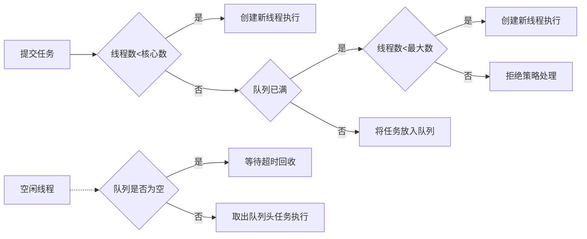

# linux cpp 网络编程学习

参考书为：linux c/c++服务器开发实践 朱文伟

## Ch3：多线程基本编程

进程是对运行时程序的封装，是**系统进行资源调度和分配的的基本单位**，线程是进程的子任务，是**CPU调度和分派的基本单位**

### **一、利用POSIX多线程API进行多线程开发**

利用POSIX多线程API进行多线程开发，需要使用一套定义了创建和操纵线程的函数，这些函数通常被称为Pthreads。Pthreads可以在Unix-like POSIX系统上运行，如Linux和Solaris

- Pthreads API中的函数可以非正式的划分为三大类： 
  1. **线程管理（Thread management）**: 第一类函数直接用于线程：创建（creating），分离（detaching），连接（joining）等等。包含了用于设置和查询线程属性（可连接，调度属性等）的函数。 
  2. **互斥量（Mutexes）**: 第二类函数是用于线程同步的，称为互斥量（mutexes），是"mutual exclusion"的缩写。Mutex函数提供了创建，销毁，锁定和解锁互斥量的功能。同时还包括了一些用于设定或修改互斥量属性的函数。 
  3. **条件变量（Condition variables）**：第三类函数处理共享一个互斥量的线程间的通信，基于程序员指定的条件。这类函数包括指定的条件变量的创建，销毁，等待和受信（signal）。设置查询条件变量属性的函数也包含其中。 

### **二、C++11中的线程类**

### **三、线程同步**

现代计算机操作系统的四大基本特性：并发，共享，虚拟，异步。

- 并发：**并发**是指宏观上在一段时间内能同时运行多个程序，而**并行**则指同一时刻能运行多个指令。单核处理器可以通过交替运行实现并发，多核处理器可以直接实现并行，但是操作系统也提供并发
- 共享：系统中的资源可供内存中多个并发执行的进程(线程)共同使用，包括互斥共享和同时共享
- 虚拟：把一个物理实体转换为多个逻辑实体
- 异步：进程不是一次性执行完毕，而是走走停停，以不可知的速度向前推进

***

- 线程同步：并发和异步机制带来了线程间资源竞争的无序性，需要同步来实现线程间正确有序的共享数据，以一致的顺序执行一组操作
- 临界资源：指一次仅允许一个线程使用的共享资源
- 临界区：每个线程中访问临界资源的代码段
- 原子操作：不会被线程调度机制打断的操作；这种操作一旦开始，就一直运行到结束，中间不会有任何上下文切换（切换到另一个线程）。原子操作可以保证数据的一致性和安全性，避免竞争和死锁的问题。原子操作通常依赖于硬件平台提供的特殊指令来实现

### **四、基于POSIX的线程同步**

互斥锁：可以通过互斥锁来同步线程访问临界资源

读写锁：提供了比互斥锁更好的并行性（并行性好不代表速度更快），以读模式加锁后，当多个线程试图以读模式加锁时，不会造成 这些线程阻塞在等待锁的释放。写模式则是独占的

条件变量：让一个线程因等待“条件变量的条件”而挂起，另外一个线程在条件成立后，立即向挂起的线程发送条件成立的信号

***

- 生产者消费者问题（producer-consumer）

  也叫做有界缓冲区问题（bounded buffer），没有条件变量可能出现死锁的问题。

***

**Pthread_cond_wait函数**：

`pthread_cond_wait`函数是一个用于在条件变量上阻塞当前线程的函数，它需要和互斥锁配合使用。它的作用是让当前线程A（阻塞并释放mutex）等待其他线程B通过`pthread_cond_signal`（唤醒一个）或`pthread_cond_broadcast`（唤醒全部）来唤醒它，从而实现线程间的同步。具体来说，他实现以下功能（其中第一步加第二步是原子操作）：

- 释放已掌握的互斥锁（解锁互斥量）相当于ptherad_mutex_unlock (&mutex);
- 阻塞等待条件变量cond
- 当被唤醒，pthread_cond_wait函数返回时，解除阻塞并重新申请获取互斥锁pthread_mutex_lock (&mutex);（也是一个原子操作）

```c++
int pthread_cond_wait(pthread_cond_t *cond, pthread_mutex_t *mutex);
```

其中，cond是一个指向条件变量的指针，mutex是一个指向互斥锁的指针。这个函数返回0表示成功，非0表示失败

### **五、C++11/14中的线程同步**

- 基本互斥锁
- 定时互斥锁
- 递归互斥锁
- 定时递归互斥锁

### 六、线程池

线程池就是一种管理线程的工具，它维护了一定数量的线程，可以重复利用已创建的线程来执行任务，避免了频繁地创建和销毁线程。这样可以降低资源消耗，提高响应速度，增加线程的可管理性。

一般来说，线程池有以下几个参数：

- 核心线程数：线程池中保持活跃的最小线程数，即使没有任务也不会被回收。
- 最大线程数：线程池中能够容纳的最大线程数，超过这个数量的任务会被拒绝。
- 任务队列：用于存放等待执行的任务的队列，可以有不同的实现方式，如数组、链表、同步队列等。
- 线程工厂：用于创建新线程的工厂类，可以自定义一些属性，如名称、优先级、守护状态等。
- 拒绝策略：当任务队列满了且达到最大线程数时，如何处理新来的任务，可以有不同的策略，如抛出异常、丢弃任务、阻塞调用者等。

---

流程如下：

- 当有新的任务提交时，首先判断当前线程池中的线程数是否小于核心数（corePoolSize），如果是，则创建一个新的线程来执行该任务，即使此时有空闲的线程。**（核心线程数是线程池中保持活跃的最小线程数，即使没有任务也不会被回收，所以如果当前活跃线程数小于核心线程数，说明还有核心线程没有创建出来，所以需要创建一个新的核心线程来执行任务。如果当前活跃线程数等于或大于核心线程数，则说明所有的核心线程都已经创建出来了，此时就可以用一个空闲的核心线程或非核心线程来执行任务。）**
- 如果当前线程数已经达到核心数，那么就判断任务队列（workQueue）是否已经满了，如果没有，则将该任务放入队列中，等待被空闲的线程取出执行。
- 如果任务队列已经满了，那么就判断当前线程数是否小于最大数（maximumPoolSize），如果是，则创建一个新的线程来执行该任务。**（线程池的设计是为了提高任务的执行效率和资源的利用率。如果任务队列已满，说明当前的任务量很大，而且可能还有新的任务提交。如果此时只使用空闲线程来执行任务，可能会导致任务等待时间过长，影响性能和用户体验。因此，线程池会创建新的线程来执行任务，直到达到最大线程数。）**
- 如果当前线程数已经达到最大数，那么就执行拒绝策略（RejectedExecutionHandler）来处理该任务，比如抛出异常、丢弃任务、阻塞调用者等。
- 当一个线程执行完一个任务后，它会变成空闲状态，并尝试从队列中取出头部的任务来执行。如果队列为空，则该线程会等待一段时间（keepAliveTime），如果超时还没有新的任务，则该线程会被回收。




